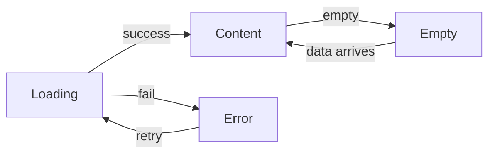

# HD Homey Design Language

> **Canonical source**: Web app (`apps/web/src/app/globals.css`)  
> **Platform adaptations**: Android (`apps/android/app/src/main/res/`)
>
> The web app defines the authoritative design tokens. Each platform implements
> them using native conventions — CSS custom properties on web, Material Design
> XML resources on Android. Always refer to this document when adding UI to
> either platform to ensure visual consistency.

---

## 1. Color System — Dark Theme

Both platforms use a consistent dark theme. Colors are WCAG 2.2 Level AA
compliant with adequate contrast ratios.

### 1.1 Background Colors

| Token               | Web CSS                     | Android (colors.xml)         | Usage                                    |
|---------------------|-----------------------------|------------------------------|------------------------------------------|
| **Primary**         | `--color-bg-primary`        | `@color/background_dark`     | Page/screen backgrounds                 |
|                     | `#1a1a1a`                   | `#1a1a1a`                    |                                          |
| **Secondary**       | `--color-bg-secondary`      | `@color/surface_dark`        | Cards, elevated surfaces, nav           |
|                     | `#2a2a2a`                   | `#2a2a2a`                    |                                          |
| **Tertiary**        | `--color-bg-tertiary`       | `@color/surface_dark_elevated`| Hover states, active items             |
|                     | `#3a3a3a`                   | `#353535`                    |                                          |

**Rules**:
- Use `bg-secondary` / `surface_dark` for all cards, panels, and elevated surfaces.
- Use `bg-tertiary` / `surface_dark_elevated` for hover/focus states.
- Do **not** use pure black (`#000000`) for backgrounds — the slightly
  lighter `#1a1a1a` reduces eye strain and improves readability.

### 1.2 Text Colors

| Token               | Web CSS                     | Android (colors.xml)         | Contrast vs bg-primary |
|---------------------|-----------------------------|------------------------------|------------------------|
| **Primary**         | `--color-text-primary`      | `@color/text_primary`        | 13.26:1                |
|                     | `#f0f0f0`                   | `#ffffff`                    |                        |
| **Secondary**       | `--color-text-secondary`    | `@color/text_secondary`      | 8.59:1                 |
|                     | `#b0b0b0`                   | `#b3b3b3`                    |                        |
| **Tertiary**        | `--color-text-tertiary`     | `@color/text_tertiary`       | 5.45:1                 |
|                     | `#909090`                   | `#808080`                    |                        |
| **Disabled**        | `--color-text-disabled`     | *(use text-tertiary at 0.5 opacity)* | 3.44:1      |
|                     | `#666666`                   |                              |                        |

**Rules**:
- **Primary text**: Body copy, headings, labels on cards.
- **Secondary text**: Supporting info, timestamps, metadata.
- **Tertiary text**: Placeholders, hints, helper text.
- **Android note**: `text_primary` uses `#ffffff` (pure white) for better
  readability on TV displays. The web uses `#f0f0f0` for reduced eye strain
  on monitors. Either is acceptable — the key is maintaining the semantic
  role hierarchy.

### 1.3 Brand & Accent Colors

| Token               | Web CSS                     | Android (colors.xml)         | Usage                                 |
|---------------------|-----------------------------|------------------------------|---------------------------------------|
| **Accent**          | `--color-accent`            | `@color/hd_homey_blue`       | Primary buttons, links, focus rings  |
|                     | `#2563eb`                   | `#007bff`                    |                                       |
| **Accent Hover**    | `--color-accent-hover`      | `@color/hd_homey_blue_dark`  | Button hover, active links            |
|                     | `#1d4ed8`                   | `#0056b3`                    |                                       |
| **Accent Active**   | `--color-accent-active`     | *(use accent hover)*         | Button pressed state                  |
|                     | `#1e40af`                   |                              |                                       |

> **⚠️ Known divergence**: Web uses `#2563eb` (blue-600 from Tailwind scale)
> while Android uses `#007bff` (classic Bootstrap blue). Future alignment
> should converge on `#2563eb` for all platforms.

**Rules**:
- Use accent blue for **primary action buttons** (connect, save, watch).
- Use accent blue for **focused indicators** (focus rings, selected items).
- Do **not** use accent blue for non-interactive decorative elements.

### 1.4 Semantic Colors

| Token            | Web CSS            | Android (colors.xml) | Usage                        |
|------------------|--------------------|----------------------|------------------------------|
| **Success**      | `#10b981`          | `#4caf50`            | Positive status, connected   |
| **Success BG**   | `#064e3b`          | *(use 25% opacity)*  | Success toast/chip bg        |
| **Error**        | `#ff5555`          | `#f44336`            | Errors, disconnected         |
| **Error BG**     | `#7f1d1d`          | *(use 25% opacity)*  | Error toast/chip bg          |
| **Warning**      | `#f59e0b`          | `#ffc107`            | Degraded state, caution      |
| **Warning BG**   | `#78350f`          | *(use 25% opacity)*  | Warning toast/chip bg        |
| **Info**         | `#3b82f6`          | *(use accent)*       | Informational status         |
| **Info BG**      | `#1e3a8a`          | *(use 25% opacity)*  | Information chip bg          |

> **⚠️ Known divergence**: Semantic color values differ between platforms.
> Align toward web values (`#10b981`, `#ff5555`, `#f59e0b`) in future
> iterations.

**Rules**:
- Semantic colors on **light backgrounds** use the main hex value.
- Semantic colors on **dark backgrounds** use the `*-bg` variant for chip/tag
  backgrounds and the main hex for icons/text.
- Do **not** use raw semantic colors for interactive elements — use accent blue.

### 1.5 Border Colors

| Token               | Web CSS               | Android (colors.xml)         | Usage                     |
|---------------------|-----------------------|------------------------------|---------------------------|
| **Border**          | `--color-border`      | *(surface_dark_elevated)*    | Card, panel, input edges  |
|                     | `#404040`             | `#353535`                    |                           |
| **Border Hover**    | `--color-border-hover`| *(accent at 50%)*           | Hovered card/input edges  |
|                     | `#505050`             |                              |                           |
| **Border Focus**    | `--color-border-focus`| *(accent)*                  | Focused input rings       |
|                     | `#2563eb`             |                              |                           |

---

## 2. Typography

### 2.1 Font Family

| Platform | Font                     | Source                    |
|----------|--------------------------|---------------------------|
| **Web**  | `'Fira Code', monospace` | Google Fonts / self-host  |
| **Android** | `monospace` / `sans-serif` *(see note)* | System font      |

**Rules**:
- Web uses a monospaced font (`Fira Code`) as its primary typeface for the
  developer-oriented UI aesthetic.
- Android uses the **system monospace** font for code-style elements (device
  codes, server URLs) and **system sans-serif** for body text to ensure
  optimal readability on TV displays.
- Android TV: Use larger type sizes (48sp+ titles) per 10-foot UI guidelines.

### 2.2 Type Scale

| Token     | Web CSS name     | Web size  | Android           | Usage                        |
|-----------|------------------|-----------|-------------------|------------------------------|
| **4xl**   | `--font-size-4xl`| 36px / 2.25rem | —               | Page titles (web)            |
| **3xl**   | `--font-size-3xl`| 30px / 1.875rem | —              | Section headings (web)       |
| **2xl**   | `--font-size-2xl`| 24px / 1.5rem  | —                | Sub-headings                 |
| **XL**    | `--font-size-xl` | 20px / 1.25rem | —                | Card titles                  |
| **LG**    | `--font-size-lg` | 18px / 1.125rem | —               | Large body / player messages |
| **Base**  | `--font-size-base`| 16px / 1rem    | `text_size_body` (16sp) | Body text            |
| **SM**    | `--font-size-sm` | 14px / 0.875rem | `text_size_caption` (14sp) | Captions, labels  |
| **XS**    | `--font-size-xs` | 12px / 0.75rem  | —                | Fine print, timestamps       |

**Android TV-specific sizes** (for 10-foot UI):
| Token     | Android name          | Size  | Usage                            |
|-----------|-----------------------|-------|----------------------------------|
| **Title** | `text_size_title`     | 32sp  | Channel names, section titles    |
| **Headline** | `text_size_headline` | 48sp  | Screen titles, welcome messages  |
| **Display** | `text_size_display`  | 96sp  | Device codes (pairing screen)    |

### 2.3 Font Weights

| Weight | CSS token                  | Android XML attribute | Usage                   |
|--------|----------------------------|-----------------------|-------------------------|
| 400    | `--font-weight-normal`     | `normal`              | Body text               |
| 500    | `--font-weight-medium`     | —                     | Emphasized body         |
| 600    | `--font-weight-semibold`   | `bold`                | Labels, headers         |
| 700    | `--font-weight-bold`       | `bold`                | Titles, headings        |

### 2.4 Line Heights

| Style     | Token                        | Value |
|-----------|------------------------------|-------|
| **Tight** | `--line-height-tight`        | 1.25  |
| **Normal**| `--line-height-normal`       | 1.5   |
| **Relaxed**| `--line-height-relaxed`      | 1.75  |

- Headings always use `tight` (1.25).
- Body text uses `normal` (1.5).
- Android uses the system default `line_spacing` which approximates `normal`.

---

## 3. Spacing System

Both platforms use a **4px base unit** for spacing.

| Token       | Value    | Android equivalent  | Usage                            |
|-------------|----------|---------------------|----------------------------------|
| `space-1`   | 4px      | 4dp                 | Tight spacing (icons + text)     |
| `space-2`   | 8px      | 8dp                 | Adjacent elements, gap between   |
| `space-3`   | 12px     | 12dp                | Card padding (compact)           |
| `space-4`   | 16px     | `tv_margin_small` = 16dp | Default padding, card margins |
| `space-5`   | 24px     | 24dp                | Section spacing, button padding  |
| `space-6`   | 32px     | `tv_margin_medium` = 32dp | Large gaps, modal padding |
| `space-8`   | 48px     | `tv_margin_large` = 48dp | Page margins (large screens) |
| `space-10`  | 64px     | —                   | Major sections                  |
| `space-12`  | 96px     | —                   | Page-level spacing              |

**Rules**:
- Consistent spacing creates visual rhythm. Don't invent arbitrary values.
- On Android TV, prefer the `tv_margin_*` named dimensions with D-pad spacing
  in mind (wider margins for focus indicators).
- On mobile Android, use the base-unit values (4dp, 8dp, 16dp) matching web.

---

## 4. Layout Patterns

### 4.1 Card-Based Surfaces

Both platforms use cards as the primary building block for content items.

**Web** (CSS Module, `InfoCard` pattern):
```css
.infoRow {
  background-color: var(--color-bg-primary);
  border: 1px solid var(--color-border);
  border-radius: var(--radius-md);  /* 8px */
  padding: var(--space-3);          /* 12px */
}
```

**Android** (XML layout, `item_channel.xml`):
```xml
<androidx.cardview.widget.CardView
    app:cardBackgroundColor="@color/surface_dark"
    app:cardCornerRadius="8dp"
    app:cardElevation="4dp"
    android:padding="16dp">
```

**Consistent card pattern**:
| Property        | Web                   | Android                |
|-----------------|-----------------------|------------------------|
| Background      | `--color-bg-secondary`| `@color/surface_dark`  |
| Border          | 1px solid `#404040`   | 4dp elevation shadow   |
| Corner radius   | 8px (radius-md)       | 8dp                    |
| Content padding | 16px (space-4)        | 16dp                   |

### 4.2 List / RecyclerView

- Web uses semantic HTML lists with CSS styling.
- Android uses `RecyclerView` with CardView items.
- Both present channel lists with: channel number → name → HD badge → favorite icon.

### 4.3 Error / Loading / Empty States

Every data-displaying screen supports three overlay states:



| State     | Web pattern                               | Android pattern                        |
|-----------|--------------------------------------------|----------------------------------------|
| **Loading** | Shimmer skeleton (`skeleton` class)     | `ProgressBar` + loading text           |
| **Error**   | Error message + retry button            | Error text + retry `Button`            |
| **Empty**   | Empty state message                     | Icon + title + description + hint      |

### 4.4 Top Bar Pattern

Both platforms use a sticky/visible top bar pattern:
- **Web**: Sticky `<header>` with logo + nav links + mobile menu
- **Android**: `CardView` top bar with tuner name + refresh `ImageButton`

---

## 5. Border Radii & Elevation

### 5.1 Border Radius

| Token           | Value  | Usage                      |
|-----------------|--------|----------------------------|
| `radius-sm`     | 4px    | Small badges, tags         |
| `radius-md`     | 8px    | Cards, inputs, buttons     |
| `radius-lg`     | 12px   | Dialogs, modals            |
| `radius-xl`     | 16px   | Bottom sheets, large cards |
| `radius-full`   | 9999px | Pills, circular elements   |

- Android `CardView` uses `8dp` corner radius (matching `radius-md`).
- Android TV: Use `12dp` radius for channel cards to improve visual
  separation on large screens.

### 5.2 Elevation & Shadows

| Token        | Web CSS                                    | Android elevation |
|--------------|---------------------------------------------|-------------------|
| Shadow SM    | `0 1px 2px 0 rgba(0,0,0,0.5)`              | 2dp               |
| Shadow MD    | `0 4px 6px -1px rgba(0,0,0,0.5)`           | 4dp               |
| Shadow LG    | `0 10px 15px -3px rgba(0,0,0,0.5)`         | 8dp               |
| Shadow XL    | `0 20px 25px -5px rgba(0,0,0,0.6)`         | 12dp              |

- Android uses Material Design elevation for shadows (native `CardView`
  elevation property). No manual shadow values needed.
- Web uses CSS `box-shadow` — always use the `--shadow-*` CSS variables.

---

## 6. Button Styles

### 6.1 Primary Button

| Property      | Web                                   | Android             |
|---------------|---------------------------------------|---------------------|
| Background    | `--color-accent` (`#2563eb`)          | `hd_homey_blue`     |
| Text color    | White                                 | `text_primary`      |
| Border        | None / transparent                    | None                |
| Min height    | `--button-height` (44px)              | `touch_target_min` (48dp) |
| Border radius | `--radius-md` (8px)                   | 8dp                 |
| Hover         | `--color-accent-hover` (`#1d4ed8`)    | *(state list animator)* |

### 6.2 Secondary Button

| Property      | Web                                   | Android                         |
|---------------|---------------------------------------|---------------------------------|
| Background    | `--color-bg-tertiary` (`#3a3a3a`)     | `surface_dark` + border         |
| Text color    | `--color-text-primary`                | `text_primary`                  |
| Border        | 1px solid `--color-border`            | `#404040`                       |

### 6.3 Danger Button

| Property      | Web                                    | Android              |
|---------------|----------------------------------------|----------------------|
| Background    | `--color-error` (`#ff5555`)            | `error_red`          |
| Text color    | White                                  | White                |
| Hover         | `#ff4444`                              | *(darker tint)*      |

---

## 7. Iconography

- **Web**: Uses unicode characters, CSS shapes, and inline SVGs.
- **Android**: Uses Android system drawables (`@android:drawable/`) and
  Material Icons from the appcompat/material libraries.
- **Channel logos**: Loaded via Coil (Android) or `` (web). Placeholder
  fallback uses system assets.

Semantic icon colors match text role hierarchy:
- Active/normal icons: `text_primary` / `--color-text-primary`
- Supporting icons: `text_secondary` / `--color-text-secondary`
- Muted icons: `text_tertiary` / `--color-text-tertiary`

---

## 8. Animation & Transitions

### 8.1 Transition Durations

| Token                | Value    | Usage                |
|----------------------|----------|----------------------|
| `--transition-fast`  | 150ms    | Hover, focus, toggle |
| `--transition-base`  | 250ms    | Slide in, expand     |
| `--transition-slow`  | 350ms    | Page transitions     |

- Android: Use `android:animateLayoutChanges="true"` for simple transitions,
  or `Animator` resources for focus animations (see `card_lift.xml`).

### 8.2 Key Animations

| Name        | Web CSS                           | Android                       |
|-------------|------------------------------------|-------------------------------|
| **Shimmer** | `shimmer` (1.5s gradient sweep)    | `shimmer.xml` (`AnimationDrawable`) |
| **Spinner** | `spin` (0.75s rotation)           | `ProgressBar` indeterminate    |
| **Fade in** | `fadeIn` (250ms)                   | Android `Fade` transition      |
| **Focus lift** | box-shadow transition          | `card_lift.xml` elevation animator |

### 8.3 Reduced Motion

Both platforms must respect user motion preferences:
- **Web**: `@media (prefers-reduced-motion: reduce)` disables animations.
- **Android**: Not yet implemented — future: `Settings.Global.ANIMATOR_DURATION_SCALE`.

---

## 9. Platform-Specific Adaptations

### 9.1 Android TV (10-Foot UI)

When running on Android TV, apply these adjustments:

| Element          | Adaptation                                                   |
|------------------|--------------------------------------------------------------|
| **Touch targets** | Minimum 48dp (vs 44px on web)                               |
| **Focus**        | Elevation-based (`card_lift` animator), not outline          |
| **Text sizes**   | Use `text_size_title` (32sp) and `text_size_headline` (48sp) |
| **Margins**      | Use `tv_margin_large` (48dp) for screen edges                |
| **Navigation**   | D-pad `nextFocusUp`/`Down` attributes on all focusable items |
| **Scrolling**    | RecyclerView with D-pad-compatible scrolling                 |

### 9.2 Phones & Tablets

When running on phones or tablets, apply web-like spacing:

| Element      | Adaptation                                             |
|--------------|--------------------------------------------------------|
| **Margins**  | Use standard `16dp` (equivalent to web `space-4`)       |
| **Text sizes** | Use `text_size_body` (16sp) and `text_size_caption` (14sp) |
| **Touch**    | Touch-native scrolling (no D-pad focus management)      |
| **Layout**   | Portrait/landscape aware via ConstraintLayout            |

---

## 10. Design Principles

1. **Dark theme first**: Both platforms ship dark-only. No light theme planned.
2. **Card-based layouts**: Content lives in elevated cards with consistent
   radius, padding, and background.
3. **Three-state screens**: Every data view supports Loading, Error, and Empty
   states in addition to the happy path.
4. **Accent blue for interaction**: Blue is reserved for interactive elements
   only — buttons, links, focus rings, selected states.
5. **Respect platform conventions**: Web uses CSS custom properties; Android
   uses Material XML resources. Map concepts, don't force cross-platform
   implementation.
6. **Accessibility first**: All colors meet WCAG 2.2 AA contrast ratios.
   Focus indicators are visible. Touch targets are generous.

---

## Appendix: Map Web CSS Variables → Android Resources

```yaml
Web CSS variable                     Android resource
────────────────────────────────────────────────────────────
--color-bg-primary: #1a1a1a     →   @color/background_dark: #1a1a1a
--color-bg-secondary: #2a2a2a   →   @color/surface_dark: #2a2a2a
--color-bg-tertiary: #3a3a3a    →   @color/surface_dark_elevated: #353535
--color-text-primary: #f0f0f0   →   @color/text_primary: #ffffff
--color-text-secondary: #b0b0b0 →   @color/text_secondary: #b3b3b3
--color-text-tertiary: #909090  →   @color/text_tertiary: #808080
--color-accent: #2563eb         →   @color/hd_homey_blue: #007bff  ⚠️
--color-accent-hover: #1d4ed8   →   @color/hd_homey_blue_dark: #0056b3 ⚠️
--color-success: #10b981        →   @color/success_green: #4caf50  ⚠️
--color-error: #ff5555          →   @color/error_red: #f44336      ⚠️
--color-warning: #f59e0b        →   @color/warning_yellow: #ffc107 ⚠️
--space-4: 16px                 →   @dimen/tv_margin_small: 16dp
--space-6: 32px                 →   @dimen/tv_margin_medium: 32dp
--space-8: 48px                 →   @dimen/tv_margin_large: 48dp
--min-touch-target: 44px        →   @dimen/touch_target_min: 48dp
--radius-md: 8px                →   cardCornerRadius: 8dp
```

> ⚠️ = Known divergence — values differ. Aim to converge on web values
> during future refactoring.

---

## Version History

| Date       | Change                        |
|------------|-------------------------------|
| 2026-06-29 | Initial design language doc   |
